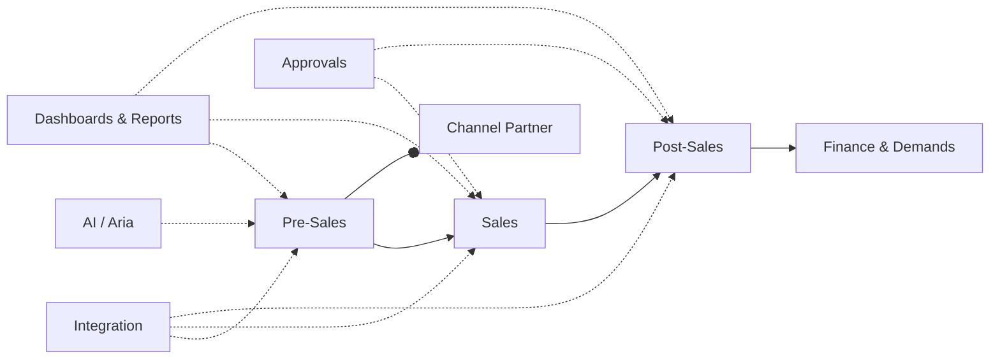
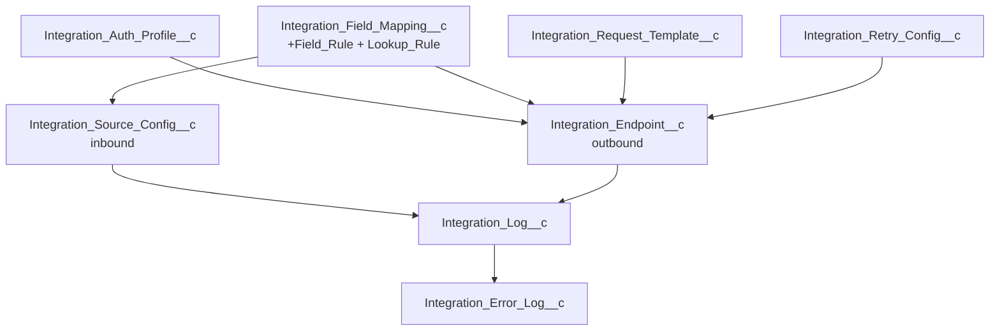

<!--
  RealMake-Product — Post-Install Configuration Guide
  Source of truth for implementation engineers and Salesforce admins.
-->

# RealMake-Product

## Post-Install Configuration Guide

> **Audience:** Salesforce admins and implementation engineers configuring the
> RealMake-Product package after deployment.
> **Outcome:** A fully configured org where Pre-Sales, Sales, Post-Sales,
> Channel Partner, GRE, and Finance teams can transact end-to-end.
> **Estimated effort:** 2 – 5 working days for a single-project org;
> 1 – 2 weeks for multi-project / multi-region rollouts.

A condensed, interactive version of this guide lives on the **Welcome Guide**
tab inside Salesforce (LWC `postInstallationGuide`). This file is the
authoritative written reference.

---

## Table of contents

1. [Overview & module map](#1-overview--module-map)
2. [How to read this guide (by role)](#2-how-to-read-this-guide-by-role)
3. [Quick-start — first 30 minutes](#3-quick-start--first-30-minutes)
4. [Pre-flight checklist](#4-pre-flight-checklist)
5. [Permission sets & profiles](#5-permission-sets--profiles)
6. [Seed Custom Metadata records](#6-seed-custom-metadata-records)
7. [Remote sites, CSP & named credentials](#7-remote-sites-csp--named-credentials)
8. [General Setup](#8-general-setup)
9. [Round Robin (lead assignment)](#9-round-robin-lead-assignment)
10. [Queues — verify membership](#10-queues--verify-membership)
11. [Lead Duplication](#11-lead-duplication)
12. [Cost Sheet (pricing)](#12-cost-sheet-pricing)
13. [Discount Approval Matrix](#13-discount-approval-matrix)
14. [Approval Configuration (generic engine)](#14-approval-configuration-generic-engine)
15. [Push To Sales (pre-sales → sales hand-off)](#15-push-to-sales-pre-sales--sales-hand-off)
16. [Post-Sales Configuration](#16-post-sales-configuration)
17. [Tabs to expose per app](#17-tabs-to-expose-per-app)
18. [Dashboards & reports](#18-dashboards--reports)
19. [Lead Scoring](#19-lead-scoring)
20. [Email templates](#20-email-templates)
21. [Document templates](#21-document-templates)
22. [Complaint Escalation Matrix](#22-complaint-escalation-matrix)
23. [Channel Partner module](#23-channel-partner-module)
24. [Integration framework](#24-integration-framework)
25. [Dynamic forms & field mapping](#25-dynamic-forms--field-mapping)
26. [AI / Aria chatbot (optional)](#26-ai--aria-chatbot-optional)
27. [Performance, forecasting & user availability](#27-performance-forecasting--user-availability)
28. [Static resources](#28-static-resources)
29. [Scheduled Apex jobs](#29-scheduled-apex-jobs)
30. [Smoke tests](#30-smoke-tests)
31. [Go-live checklist](#31-go-live-checklist)
32. [Troubleshooting matrix](#32-troubleshooting-matrix)
33. [Glossary](#33-glossary)

---

## 1. Overview & module map

RealMake-Product is a real-estate CRM suite. Configuration is grouped into
nine functional modules, each rendered by Lightning Web Components and backed
by configuration records:



| Module | Primary records | Primary tabs / LWCs |
|---|---|---|
| **Pre-Sales** | `Lead__c`, `Followup__c`, `Site_Visit__c`, `Campaign__c` | Pre-Sales Admin Config, Round Robin Configurator, Duplication Configurator, Lead Scoring Designer |
| **Sales** | `Booking__c`, `Cost_Sheet__c`, `Unit__c`, `Tower__c`, `Project__c` | Formula Builder, Discount Approval Matrix, Push To Sales |
| **Post-Sales** | `Payment_Schedule__c`, `Demands__c`, `Receipt__c`, `Refund__c`, `Credit_Note__c`, `Debit_Note__c` | Post-Sales Admin |
| **Channel Partner** | `Channel_Partner__c`, `CP_Module_Config__c`, `Daily_Log__c` | CP Module Config |
| **Approvals** | `Approval_Configuration__c`, `Discount_Approval_Matrix__c` | Approval Center, Bulk Approval Manager, Step Builder |
| **Integration** | `Integration_*__c`, `Integration_*__mdt` | Integration Dashboard, Mapping Designer, Test Console |
| **Forms & Mapping** | `Dynamic_Form_Configuration__c`, `Field_Mapping_*__c` | Form Configurator Builder, Field Mapping Setup |
| **AI / Aria** | `AI_Integration_Config__mdt` | Aria Chat Bot, Aria Lead Capture Form |
| **Dashboards / Reports** | `Dashboard_*__mdt`, `Dashboard_Configuration__c`, `Report_Configuration__c` | CRM Dashboards, CRM Reports |

---

## 2. How to read this guide (by role)

| Role | Read sections | Skip |
|---|---|---|
| **Tech / project lead** | 1 – 4, 31 – 32 | — |
| **Salesforce admin** (full setup) | All | — |
| **Pre-Sales lead** | 8, 9, 10, 11, 15, 19, 20 | 12 – 14, 16 |
| **Sales lead** | 12, 13, 14, 15, 17, 21 | 11, 19 |
| **Post-Sales / Finance lead** | 14, 16, 18, 20, 21, 22 | 9, 11, 19 |
| **CP manager** | 19, 23, 20 | 12 – 16 |
| **Integration engineer** | 6, 7, 24, 25 | 9, 11 – 13 |
| **AI / digital lead** | 6, 7, 26 | — |

---

## 3. Quick-start — first 30 minutes

Do these six things before anything else. They unblock the rest of the setup.

1. **Verify the deploy succeeded** — Setup → Deployment Status → all green.
2. **Assign yourself System Administrator** plus the two platform permission
   sets (Section 5).
3. **Import the seed CMDT bundle** (Section 6). Without it, Cost Sheet, Lead
   status modal, and the home dashboard will look empty.
4. **Replace the placeholder remote site** `ApexDevNet` with the customer's
   real outbound hosts (Section 7).
5. **Create one active `General_Setup__c` row** (Section 8) so the duplication
   fallback and Push-To-Sales target are defined.
6. **Open the Welcome Guide tab** — it lists the next six configuration tasks
   in the in-app accordion.

You can now hand off the org to functional leads and continue with the rest of
this guide module-by-module.

---

## 4. Pre-flight checklist

| Item | Where to check | Expected |
|---|---|---|
| Package deploy status | Setup → Deployment Status | All components **Succeeded** |
| Source API version | `sfdx-project.json` | `62.0` or higher |
| My Domain | Setup → My Domain | Deployed **and** enabled (LWCs require it) |
| Lightning Experience | Setup → Lightning Experience Transition | Enabled |
| Person Accounts | Setup → Account Settings | Enable **only** if the customer uses them |
| Multi-currency | Setup → Company Information | Enable **before** seeding pricing data |
| Email deliverability | Setup → Deliverability | Access level = **All email** (Sandbox: System only) |
| Org-wide email addresses | Setup → Organization-Wide Addresses | At least one verified, matching template `From_Address__c` values |

> Install **Salesforce Inspector Reloaded** (Chrome / Edge / Firefox) before
> Section 6 — every CMDT seed step uses its Data Import panel.

---

## 5. Permission sets & profiles

The package ships with two platform-managed permission sets and expects you to
extend the customer's existing profiles. Do this **before** anything else,
otherwise tabs and LWCs will not render.

### 5.1 Permission sets to assign

| Permission set | Assign to |
|---|---|
| `sfdc_nc_constraints_engine_deploy` | Admins / power users |
| `sfdc_scrt2` | Admins / power users |

### 5.2 Profile updates (per team)

For each functional team — Pre-Sales, Sales, Post-Sales, Channel Partner,
GRE, Finance — clone an existing profile and grant:

- **Object access** to every `__c` object the team touches.
- **Tab visibility** for the tabs listed in Section 17.
- **Apex class access** for the controllers behind the LWCs the team uses,
  e.g. `FormulaBuilderController`, `PushToSalesController`,
  `ApprovalCenterController`.
- **Visualforce page access** for the VF demand-letter pages.
- **Field-level security** — at minimum, the picklists in
  `Lead_Status_Action_Config__mdt` and the financial fields on `Cost_Sheet__c`
  / `Booking__c`.

> While the customer is still finalising profiles, assigning the implementation
> user **System Administrator** keeps the rest of the setup unblocked.

---

## 6. Seed Custom Metadata records

Several modules ship with empty Custom Metadata Types. Seed them once, then
the features below will work. The CSV bundle is on the public link in the
Welcome Guide LWC (`postInstallationGuide.js`, step `upload`).

### 6.1 Import flow (per CMDT)

1. Open the target org and **Salesforce Inspector** → **Data Import**.
2. **Action** = `Insert` (use `Upsert` if re-running after fixes).
3. **Object** = the CMDT API name from the table below.
4. Paste / drag the CSV from the bundle.
5. Click **Run Import**. Fix and re-run any failed rows.

### 6.2 CMDT inventory

| CMDT API name | Purpose | Required? |
|---|---|---|
| `Cost_Sheet_Field_Config__mdt` | Field layout, order, visibility, defaults for the Cost Sheet UI | **Yes** |
| `Lead_Status_Action_Config__mdt` | Per-status rules: requires follow-up / site visit / lost reason / remarks | **Yes** |
| `Dashboard_Tab_Config__mdt` | Tabs shown on the home notification dashboard | **Yes** |
| `Dashboard_Field_Config__mdt` | Fields shown on each dashboard tab card | **Yes** |
| `AI_Integration_Config__mdt` | Provider, model, endpoint, API key for Aria / AI | If AI used |
| `Forecast_Config__mdt` | Funnel stages, moving-average window, seasonality, health-score weights | If forecasting used |
| `Shift_Configuration__mdt` | Working-hour shifts (start / end / default) | If availability tracked |
| `User_Availability_Profile_Config__mdt` | Maps profiles → shifts and visible profiles | If availability tracked |
| `Integration_Doc_Setting__mdt` | Company name, header colour, logo, watermark for integration documents | If outbound docs issued |

### 6.3 Editing later

- Single record → Setup → Custom Metadata Types → **Manage Records → Edit**.
- Bulk → Salesforce Inspector **Data Export** → spreadsheet edit → **Data
  Import** with **Action = Update**.

---

## 7. Remote sites, CSP & named credentials

The package deploys one placeholder remote site (`ApexDevNet`,
http://www.apexdevnet.com). Replace / extend it before any callout will work.

| Setup area | Add entries for |
|---|---|
| **Remote Site Settings** | Every external host hit by Apex callouts (payment gateway, SMS, email, AI provider, ERP, document service). Set `Disable Protocol Security = false`. |
| **CSP Trusted Sites** | Every external domain whose resources (fonts, scripts, iframes) the LWCs load. |
| **Named Credentials** | OAuth and signed callouts — prefer this over hardcoded URLs in `Integration_Endpoint__c`. |
| **Auth. Providers** | If OAuth flows are user-initiated, define them here first. |

> For payment gateways and AI providers, you **also** need to add their hosts
> in CSP Trusted Sites or the LWC will silently fail to render embedded UI.

---

## 8. General Setup

**Object:** `General_Setup__c` — one active row per org defines fallback
behaviour for two cross-cutting features.

| Field | Allowed values | Purpose |
|---|---|---|
| `Is_Active__c` | `true` | Exactly one active row at a time |
| `Lead_Duplication_Type__c` | `Close` / `Merge` / `Flag` | Fallback when no `Duplication_Configuration__c` rule matches |
| `Push_To_Sales_Type__c` | `Booking` / `Opportunity` / both | Target record created by Push-To-Sales |
| `Description__c` | free text | Document environment intent (e.g. "UAT — flag only") |

**Where:** App Launcher → search `General Setup` (or Setup → Object Manager →
`General_Setup__c` → list view).

---

## 9. Round Robin (lead assignment)

Distribute inbound leads across a team using filter-driven buckets and a
sequenced rotation.

### 9.1 Configure

1. Open the **RoundRobin Configurator** tab (LWC `roundRobinConfiguratorLWC`)
   — or **RR Wizard** for an end-to-end guided flow.
2. Create one `Round_Robin__c` bucket per team / region (e.g. *US Platinum*).
3. Add filter rows in `Round_Robin_Filter__c` (project, source, lead type,
   country). **Filters within a bucket are AND-ed**; create multiple buckets
   for OR semantics.
4. Add members in `Round_Robin_Member__c`. The **sequence number** controls
   rotation; the lowest sequence receives the next eligible lead.
5. (Optional) Weight members via `Round_Robin_Field_Priority__c`.
6. Make sure the matching **queues** (Section 10) exist for the bucket.

### 9.2 Verify

- Create a test lead matching the bucket's filters.
- Confirm ownership lands on the next member in rotation; create a second
  matching lead and confirm it rotates.

---

## 10. Queues — verify membership

The package deploys these Lead / Case queues, **but with no members**. Add
public groups or users to each one (Setup → Queues):

- `USLeads`, `USPlatinumGold`, `USSilverBronze`, `USEscalations`
- `InternationalLeads`, `InternationalPlatinumGold`,
  `InternationalSilverBronze`, `InternationalEscalations`
- `PartnerRelations`

---

## 11. Lead Duplication

1. Open the **Duplication Configurator** tab (LWC `duplicationConfigurator`).
2. Create one or more `Duplication_Configuration__c` rules. For each rule pick:
   - **Match fields** (e.g. `Mobile + Project + Source`).
   - **Action** — `Close`, `Merge`, or `Flag`.
3. Schedule `CleanupDuplicateLeadsBatch` (snippet in `/scripts`) to run
   nightly:

   ```apex
   System.schedule(
       'Cleanup Duplicate Leads',
       '0 0 1 * * ?',
       new CleanupDuplicateLeadsBatch()
   );
   ```

4. **Verify** — create a duplicate Lead; it should be flagged / closed /
   merged within seconds.

---

## 12. Cost Sheet (pricing)

Per-project pricing lives on `Project__c`.

### 12.1 Configure

1. Confirm `Cost_Sheet_Field_Config__mdt` rows were seeded (Section 6).
2. Open each `Project__c` record.
3. Launch **Formula Builder** from the Project page (LWC `formulaBuilder`,
   controller `FormulaBuilderController`).
4. For each line item (Base Price, GST %, PLC, Floor Rise / Sqft,
   Maintenance / Sqft, Stamp Duty, Registration, …) define the formula or
   map it to a Project field.
5. **Save** — every Cost Sheet generated for that project will pick up these
   formulas automatically.
6. (Optional) Create `Project_Calculation_Template__c` to share a formula set
   across multiple projects.

### 12.2 Verify

- Open a Lead linked to the project.
- Run the **New Cost Sheet** quick action — confirm totals match expected
  math.
- Approve the Cost Sheet, then promote it via the **Create Booking** quick
  action (LWC `createBookingFromCostSheet`).

---

## 13. Discount Approval Matrix

1. Open the **Discount Approval Matrix** tab (LWC `discountMatrixForm` /
   `discountApprovalPanel`).
2. Add a `Discount_Approval_Matrix__c` row per band — example:

   | Discount band | Approver |
   |---|---|
   | 0 – 5 % | Auto-approve |
   | 5 – 15 % | Sr. Manager |
   | > 15 % | Director |

3. Pick approver users **or** queues per row.
4. Schedule `DiscountApprovalEscalationBatch` so unattended approvals
   auto-escalate to the next level.
5. Audit trail of every approval / rejection lands in
   `Discount_Approval_Log__c`.

---

## 14. Approval Configuration (generic engine)

`Approval_Configuration__c` powers the dynamic approval engine used by
Booking, Refund, Unit Block, Cost Sheet, etc.

| Field | Purpose |
|---|---|
| `Process_Label__c` | Human-readable name shown in the Approval Center |
| `Process_Type__c` | `Booking` / `Refund` / `Unit Block` / `Cost Sheet` / … |
| `Object_API_Name__c` | The triggering object's API name |
| `Status_Field_API_Name__c` | The status picklist field |
| `Pending_Status_Value__c` | Status while approval is in flight |
| `Approved_Status_Value__c` | Status on approval |
| `Rejected_Status_Value__c` | Status on rejection |
| `Approval_Process_API_Name__c` | (Optional) Existing Salesforce approval process |
| `Steps_JSON__c` | Steps definition — built via `approvalStepConfig` / `stepBuilder` LWCs |
| `Required_Fields_JSON__c` | Fields that must be populated before submit |
| `Matching_Criteria__c` | Expression selecting eligible records |
| `On_Approval_JSON__c` | Field updates / actions on approval |
| `On_Rejection_JSON__c` | Field updates / actions on rejection |
| `Prerequisite_Process_Type__c` + `Prerequisite_Status_Value__c` | Chain approvals (e.g. Cost Sheet must be approved before Booking) |
| `Sequence_Order__c` | Order when multiple configs match |
| `Is_Active__c` | true |

End-users approve via the **Approval Center** (LWC `approvalCenter`) or
**Bulk Approval Manager**.

---

## 15. Push To Sales (pre-sales → sales hand-off)

> **The canonical setup tab is `Pre-Sales Admin Config` → `General Setup
> Config` sub-tab.** The standalone `Push To Sales Field Map` tab is
> deprecated.

### 15.1 Configure

1. Open the **Pre-Sales Admin Config** tab (LWC `presalesAdminConfig`).
2. Switch to the **General Setup Config** sub-tab.
3. Define the pre-sales → sales **field mapping** (uses
   `Field_Mapping_Configuration__c` + `Field_Mapping_Detail__c`).
4. Add the `Lead__c.Push_to_Sales` quick action (LWC `pushToSalesAction`,
   controller `PushToSalesController`) to the Lead page layout used by
   pre-sales reps.
5. Add the **Push To Sales** tab to the Sales app for visibility on
   handed-over records.

### 15.2 Verify

- Push a qualified Lead.
- Confirm the resulting Booking / Opportunity carries the mapped fields and
  the new owner from the Push-To-Sales config.

For bulk imports use **Pre-Sales Bulk Config** (LWC `presalesBulkConfig`).

---

## 16. Post-Sales Configuration

The post-sales engine is driven by `Post_Sales_Configuration__c` rows
(per process) and `Post_Sales_Config_Master__c` (global defaults).

### 16.1 Configuration matrix

Create one `Post_Sales_Configuration__c` row per process type:

| Group | Field | Purpose |
|---|---|---|
| **Selector** | `Configuration_Type__c` | `Demand` / `Receipt` / `Refund` / `Credit Note` / `Debit Note` / `Schedule` |
| | `Matching_Criteria__c` | Records the config applies to |
| | `Is_Active__c` | true |
| **Schedule** | `Schedule_Mode__c`, `Schedule_Source__c`, `Schedule_Edit_Mode__c` | How payment schedules are generated and edited |
| **Demand** | `Demand_Mode__c`, `Demand_Due_Duration__c`, `Due_Date_Offset_Days__c`, `Grace_Period_Days__c` | Demand cadence |
| **Receipt** | `Receipt_Creation_Mode__c`, `Receipt_Amount_Field__c`, `Receipt_Field_Mapping__c` | Receipt generation |
| **Documents** | `Document_Template__c`, `VF_Page_Name__c` | Output document |
| **Email** | `Email_Template__c`, `Auto_Send_Email__c` | Outbound email |
| **Approval** | `Approval_Configuration__c` | Links to Section 14 |
| **Financials** | `Include_Interest__c`, `Include_Previous_Dues__c`, `Amount_Composition_Config__c` | Amount composition |
| **Reminders** | `Enable_Reminders__c`, `Reminder_Config__c` | Reminder cadence |

### 16.2 Project-level demand-letter defaults

`Demand_Letter_Config__c` — one row per `Project__c`. Set template, email
template, grace days, interest flag.

### 16.3 Payment schedule master

`Master_Payment_Schedule__c` — one row per milestone:

| Field | Notes |
|---|---|
| `Sequence__c` | Order of the milestone |
| `Percentage__c` | % of total due at this milestone |
| `Days_After_Booking__c` / `Days_After_Previous__c` | Cadence |
| `Payment_Type__c` | `Booking` / `Construction` / `Possession` / … |
| `Applicable_For__c` | Project / Unit type filter |
| `Milestone_Description__c` | Free text for the demand letter |
| `Is_Active__c` | true |

---

## 17. Tabs to expose per app

App Builder → **App Manager → edit → Navigation Items**. Suggested mapping:

### 17.1 Pre-Sales app

`Lead__c`, `Followup__c`, `Site_Visit__c`, `Campaign__c`, `Enquiry_Source__c`,
`RoundRobin_Configurator`, `Duplication_Configurator`,
`Pre_Sales_Admin_Config`, `Pre_Sales_Bulk_Config`, `Lead_Scoring_Designer`,
`Welcome_Guide`.

### 17.2 Sales app

`Booking__c`, `Cost_Sheet__c`, `Unit__c`, `Tower__c`, `Project__c`,
`Car_Parking__c`, `Push_To_Sales`, `Formula_Builder`,
`Discount_Approval_Matrix`, `Discount_Approval_Log__c`.

### 17.3 Post-Sales / Finance app

`Payment_Schedule__c`, `Master_Payment_Schedule__c`, `Refund__c`,
`Post_Sales_Admin`, `Unit_Block_Request__c`, `Complaint__c`, `Inspection__c`.

### 17.4 Channel Partner app

`Channel_Partner__c`, `CP_Module_Config__c`, `Daily_Log__c`.

### 17.5 Admin / cross-functional

`CRM_Dashboards`, `CRM_Reports`, `Field_Mapping_Setup`,
`Integration_Mapping_Designer`, `Integration_Source_Config__c`,
`Integration_Field_Rule__c`, `Integration_Lookup_Rule__c`, `GRE`,
`Bulk_Lead_Reassignment`, `Formula_Builder`, `Welcome_Guide`.

---

## 18. Dashboards & reports

The home dashboard is driven by CMDT plus optional record-level overrides.

1. Seed `Dashboard_Tab_Config__mdt` (Section 6) — which tabs appear.
2. Seed `Dashboard_Field_Config__mdt` (Section 6) — fields per tab card.
3. (Optional) Override per user / per org with `Dashboard_Configuration__c`
   (JSON, edited via the **Dashboard Configurator** LWC).
4. Configure reports via `Report_Configuration__c` and the
   **Report Configurator** LWC; users consume them through `reportViewer`.

---

## 19. Lead Scoring

1. Open the **Lead Scoring Designer** tab (LWC `leadScoringDesigner`).
2. Create `Lead_Score_Tier__c` rows — Hot / Warm / Cold thresholds.
3. Create `Lead_Score_Rule__c` rows. Each rule is one positive or negative
   signal — e.g. *Source = Website → +10*, *Site Visits ≥ 2 → +20*.
4. Activate the rules (`Is_Active__c = true`).
5. Recompute scores on existing leads via the batch button on the designer.

---

## 20. Email templates

**Object:** `Email_Template_Config__c`. Editor: `emailSender`,
`emailFieldPicker`, `emailMergeFieldPicker`, `emailPreviewModal`.

| Field | Purpose |
|---|---|
| `Template_Name__c` | Display name |
| `Object_API_Name__c` | The object the template is bound to |
| `Subject__c` | Subject line — supports merge fields |
| `Email_Body__c` | HTML body |
| `Recipients_Config__c` | JSON list of recipient fields / users / queues |
| `From_Address__c` | Must match a verified Org-Wide Address |
| `Reply_To__c` | Reply-to address |
| `Attachments_Config__c` | JSON for static / dynamic attachments |
| `Matching_Criteria__c` | When this template auto-applies |
| `Allow_Additional_Recipients__c` | Whether the sender can add ad-hoc recipients |
| `Is_Default__c` | Exactly one default per `(Object_API_Name__c, Action_Binding__c)` |
| `Is_Active__c` | true |
| `Action_Binding__c` | The button / process that fires it |

---

## 21. Document templates

**Object:** `Document_Template__c`. Editor: `documentDesigner`,
`documentManager`, `documentViewer`.

| Field | Purpose |
|---|---|
| `Object_API_Name__c` | Source object |
| `Template_HTML__c` / `Template_JSON__c` / `Template_Content_Document_Id__c` | Pick the rendering pipeline you use |
| `Page_Size__c`, `Page_Orientation__c` | PDF layout |
| `Logo_URL__c` | Branded header |
| `File_Name_Pattern__c` | e.g. `Demand-{!Booking__c.Name}-{!TODAY()}.pdf` |
| `Action_Binding__c` | Button / process that emits the document |
| `Display_Context__c` | Where in the UI the template is offered |
| `Include_Related_Lists__c` | Append related-list tables |
| `Matching_Criteria__c` | Auto-selection criteria |
| `Active__c` | true |

Link templates from `Post_Sales_Configuration__c.Document_Template__c` and
`Demand_Letter_Config__c.Document_Template__c`.

---

## 22. Complaint Escalation Matrix

**Object:** `Complaint_Escalation_Matrix__c`. One row per
**Project × Category × Priority**.

| Level | Days field | User field | Notify flag |
|---|---|---|---|
| Level 1 | `Level_1_Days__c` | `Level_1_User__c` | `Level_1_Notify__c` |
| Level 2 | `Level_2_Days__c` | `Level_2_User__c` | `Level_2_Notify__c` |
| Level 3 | `Level_3_Days__c` | `Level_3_User__c` | `Level_3_Notify__c` |

Toggle `Auto_Reassign__c` to change ownership automatically on SLA breach.
Edit through the `complaintEscalationConfig` LWC.

---

## 23. Channel Partner module

**Object:** `CP_Module_Config__c`. Create one active row per CP onboarding
flow.

| Field | Purpose |
|---|---|
| `CP_Source_Name__c` | Lead Source value for CP-originated leads |
| `Assignment_Type__c` | Routing rule for CP leads (Round Robin / Owner of CP / …) |
| `CP_Approval_Process__c` | Approval used to activate a CP |
| `CP_Active_Statuses__c` | Multi-value list of "active" statuses |
| `Credit_Active_Status__c` / `Credit_Expired_Status__c` / `Credit_Expiry_Days__c` | CP credit / commission lifecycle |
| `Lead_Default_Status__c`, `Lead_Inactive_Statuses__c`, `Lead_Reengaged_Type__c`, `Lead_Reopened_Type__c` | Lead state transitions for CP-sourced leads |
| `Is_Active__c` | true |

---

## 24. Integration framework

A full integration stack ships with the package. Configure only the parts the
customer needs.



### 24.1 Auth profiles — `Integration_Auth_Profile__c`

One row per credential set. Pick `Auth_Type__c` and fill **only** the fields
for that type:

| Auth type | Required fields |
|---|---|
| API Key | `API_Key__c`, `Auth_Header_Name__c`, `Auth_Token_Prefix__c` |
| Basic | `Username__c`, `Password__c` |
| Bearer | `API_Key__c` |
| OAuth2 | `OAuth_Client_Id__c`, `OAuth_Client_Secret__c`, `OAuth_Token_Endpoint__c`, `OAuth_Grant_Type__c`, `OAuth_Scope__c`, `Token_Cache_Duration__c` |
| HMAC | `HMAC_Algorithm__c`, `HMAC_Header_Name__c`, `HMAC_Secret__c` |

> Store production secrets in **Protected Custom Settings** or **Named
> Credentials** if PCI / PII is in scope.

### 24.2 Endpoints — `Integration_Endpoint__c`

URL + method + headers per outbound call. Each endpoint links to an
`Integration_Auth_Profile__c`. UI: `integrationEndpointList`,
`integrationEndpointForm`.

### 24.3 Source configs — `Integration_Source_Config__c`

For inbound calls:

| Field | Purpose |
|---|---|
| `Source_Name__c` | Logical name |
| `Endpoint_URL__c` | Site / Public URL |
| `Target_Object__c` | Object created / updated |
| `API_Schema_JSON__c` | Expected payload schema |
| `Validation_Rules_JSON__c` | Server-side validation |
| `Enable_Duplicate_Check__c` | Toggles dedup |

### 24.4 Field mappings

- `Integration_Field_Mapping__c` — source ↔ target field map.
- `Integration_Field_Rule__c` — transform rules.
- `Integration_Lookup_Rule__c` — resolve a foreign key from a payload value.
- `Integration_Response_Mapping__c` — map outbound responses back onto the
  Salesforce record.

UI: **Integration Mapping Designer** (`integrationMappingDesigner`),
**Field Mapping Setup** (`fieldMappingSetup`, `fieldMapper`).

### 24.5 Request templates

`Integration_Request_Template__c` — body templates with merge fields,
referenced by outbound calls.

### 24.6 Retry

`Integration_Retry_Config__c` — max attempts, back-off seconds, status codes
to retry, dead-letter behaviour.

### 24.7 Monitoring

Logs land in `Integration_Log__c`, `Integration_Error_Log__c`, and
`Field_Mapping_Error_Log__c`. Surface them via **Integration Dashboard**
(`integrationDashboard`, `integrationMonitorCards`, `integrationErrorPanel`).
Schedule a retention batch (Section 29) to trim old logs.

### 24.8 Test console

Use the `integrationTestConsole` LWC to dry-run any endpoint without touching
production records — recommended for every change.

---

## 25. Dynamic forms & field mapping

- `Dynamic_Form_Configuration__c` — runtime forms via `dynamicFormButton`,
  `dynamicFormModal`, `dynamicFormAction`. Editor: `formConfiguratorBuilder`.
- `Field_Mapping_Configuration__c` + `Field_Mapping_Detail__c` — runtime
  field remapping for inbound and Push-To-Sales flows. Editor:
  `fieldMappingSetup`.

---

## 26. AI / Aria chatbot (optional)

Skip entirely if AI is not licensed by the customer.

1. Seed at least one active `AI_Integration_Config__mdt` row:

   | Field | Value |
   |---|---|
   | `Provider__c` | `OpenAI` / `Anthropic` / `Azure OpenAI` / etc. |
   | `Model__c` | Model identifier |
   | `Endpoint__c` | Provider API base URL |
   | `API_Key__c` | API key (consider PCS for prod) |
   | `Is_Active__c` | true |

2. Add the provider host to **Remote Site Settings** and **CSP Trusted
   Sites** (Section 7).
3. (Optional) Configure language / locale via `ariaLangLocale`.
4. Place `aiChatBot` / `ariaChatBot` on a Lightning Home or App page.
5. Place `ariaLeadCaptureForm` on a public Experience Cloud site for
   inbound chat-to-lead.

---

## 27. Performance, forecasting & user availability

All three modules are optional.

### 27.1 Performance

- Targets: `Performance_Target__c` — one per user per period.
- Snapshots: `Performance_Snapshot__c` — produced by the scoring batch.
- UI: `performanceManager`, `performanceLeaderboard`,
  `performanceTargetForm`.

### 27.2 Forecasting

- Requires `Forecast_Config__mdt` (Section 6).
- UI: `salesForecaster`.

### 27.3 User availability

- Requires `Shift_Configuration__mdt` and
  `User_Availability_Profile_Config__mdt`.
- UI: `userAvailabilityManager`, `myAvailabilityToggle`.

---

## 28. Static resources

| Static Resource | Action |
|---|---|
| `Property_images` | Replace with the customer's project imagery (zip). |
| `SiteSamples` | Sample HTML / CSS bundle for Experience Cloud — replace if used. |
| `chartjs` | Third-party chart library; **do not modify**. |

---

## 29. Scheduled Apex jobs

Schedule these after the records above are configured (Setup → **Apex Classes
→ Schedule Apex**, or via anonymous Apex).

| Job | Cadence | Purpose |
|---|---|---|
| `CleanupDuplicateLeadsBatch` | Daily 01:00 | Resolve duplicate leads per `Duplication_Configuration__c` |
| `DiscountApprovalEscalationBatch` | Daily 08:00 | Escalate pending discount approvals past SLA |
| Demand reminder batch | Daily | Send demand-letter reminders per `Reminder_Config__c` |
| Complaint escalation batch | Hourly / daily | Honour `Complaint_Escalation_Matrix__c` SLAs |
| Integration retry batch | Every 30 min | Retry failed integration calls per `Integration_Retry_Config__c` |
| Integration log purge | Weekly | Trim `Integration_Log__c` / `Integration_Error_Log__c` |
| Lead score recompute | Daily | Rebuild lead scores after rule changes |

---

## 30. Smoke tests

Run all of these **before** declaring the org configured. Each maps to one
module above.

| # | Test | Module |
|---|---|---|
| 1 | Lead matches a Round Robin filter and lands on the correct user | §9 |
| 2 | Duplicate Lead is closed / merged / flagged per the active rule | §11 |
| 3 | Cost Sheet totals match expected math; Create Booking produces a Booking with mapped fields | §12 |
| 4 | Discount request > 5 % triggers approval to the configured approver | §13 |
| 5 | Push To Sales on a qualified Lead creates the right Opportunity / Booking, with the right owner | §15 |
| 6 | Demand Letter raised on a Booking emails the right template and attaches the right PDF | §16 |
| 7 | Complaint left untouched breaches Level 1 SLA after `Level_1_Days__c` days and re-assigns / notifies | §22 |
| 8 | Integration Test Console returns 200 for every active endpoint | §24 |
| 9 | Approval Center lists pending items for the logged-in approver | §14 |
| 10 | Welcome Guide tab loads with all six in-app sections expanded | §1 |

---

## 31. Go-live checklist

- [ ] All seed CMDT rows imported (§6)
- [ ] One active `General_Setup__c` row (§8)
- [ ] Round Robin buckets, members, queues populated (§9, §10)
- [ ] Duplication rule + scheduled batch (§11)
- [ ] Cost Sheet formulas saved on every active `Project__c` (§12)
- [ ] Discount Approval Matrix populated for every band (§13)
- [ ] Approval Configurations created for every approving process (§14)
- [ ] Push-To-Sales mapping defined and quick action on layout (§15)
- [ ] Post-Sales config + demand-letter config + payment-schedule master populated (§16)
- [ ] Apps / tabs exposed to each team (§17)
- [ ] Dashboards & reports configured (§18)
- [ ] Lead scoring rules + tiers active (§19)
- [ ] Email and document templates created and linked (§20, §21)
- [ ] Complaint Escalation Matrix populated per project (§22)
- [ ] Channel Partner module configured (§23) — if in scope
- [ ] Integration auth profiles, endpoints, mappings, retry config in place (§24) — if in scope
- [ ] AI chatbot wired up (§26) — if licensed
- [ ] Scheduled Apex jobs activated (§29)
- [ ] Smoke tests in §30 all pass

---

## 32. Troubleshooting matrix

| Symptom | Likely cause | Fix |
|---|---|---|
| Welcome Guide tab is blank | My Domain not enabled | Setup → My Domain → deploy & enable |
| Cost Sheet UI shows no fields | `Cost_Sheet_Field_Config__mdt` not seeded | Re-run the CMDT import (§6) |
| Home dashboard is empty | `Dashboard_Tab_Config__mdt` / `Dashboard_Field_Config__mdt` not seeded | Re-run the CMDT import (§6) |
| Lead status modal missing follow-up / lost-reason prompts | `Lead_Status_Action_Config__mdt` rows missing or `Is_Active__c = false` | Seed / activate rows (§6) |
| New leads not getting assigned | Bucket has no members **or** filter doesn't match the lead **or** queue has no members | Re-check §9 and §10 |
| Discount approval stuck | No matrix row covers the band, or the approver is inactive | Review §13 |
| Push To Sales does nothing | Quick action not on layout, or field mapping empty in Pre-Sales Admin Config | Re-check §15 |
| Demand email not sent | `Auto_Send_Email__c = false`, or the Email Template's `From_Address__c` isn't a verified Org-Wide Address | Review §16, §20 |
| Outbound callout fails with `Unauthorized endpoint` | Host missing from Remote Site Settings | Add the host (§7) |
| LWC won't render external iframe / font | Host missing from CSP Trusted Sites | Add the host (§7) |
| Aria / AI chat fails silently | `AI_Integration_Config__mdt` missing, inactive, or provider host not in Remote Sites | Review §26 |
| Integration retries forever | `Integration_Retry_Config__c` has unbounded `Max_Attempts__c` or no dead-letter | Set bounded retries (§24.6) |
| Approval Center empty for everyone | `Approval_Configuration__c.Is_Active__c = false`, or `Matching_Criteria__c` matches nothing | Review §14 |

---

## 33. Glossary

| Term | Meaning |
|---|---|
| **CMDT** | Custom Metadata Type — config records deployed as metadata |
| **PCS** | Protected Custom Setting — preferred storage for secrets |
| **LWC** | Lightning Web Component |
| **OWA / OWE** | Organization-Wide Email Address |
| **CP** | Channel Partner |
| **GRE** | Guest Relations Executive (walk-in module) |
| **Aria** | The AI chatbot persona shipped with the package |
| **Round Robin bucket** | A `Round_Robin__c` record with its filters and members |
| **Cost Sheet** | The pricing breakdown produced for a Lead / Unit before booking |
| **Demand Letter** | The notice asking a customer to pay a milestone instalment |

---

_For an interactive, searchable version of this guide inside Salesforce, open
the **Welcome Guide** tab in any Lightning app the package is deployed to._
